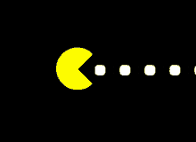

# Pac-Man Game (make-your-game)



This project, **make-your-game**, is a browser-based simulation inspired by the classic Pac-Man game. The objective is to navigate a maze, collecting pellets, avoiding ghosts, and reaching the highest score possible. The game includes features like warp tunnels, dynamic ghost behaviors, and animations for a visually engaging experience.

## Project Overview

The program simulates Pac-Man's journey through a grid-based maze while adhering to the original game's mechanics. The player controls Pac-Man's movement and must:

1. Collect all pellets.
2. Avoid getting caught by the ghosts.
3. Use warp tunnels strategically to outsmart ghosts.

Ghosts follow unique movement patterns, dynamically targeting Pac-Man while occasionally entering scatter mode.

### How It Works

The game uses a JavaScript-based engine to:

1. Render the maze, pellets, player, and ghost positions dynamically.
2. Implement collision detection using geometric calculations.
3. Define distinct behaviors for each ghost (Blinky, Pinky, Inky, Clyde).
4. Track player score, lives, and time, with real-time updates.

### Features

- **Dynamic Ghost AI**: Each ghost has a unique behavior pattern influenced by Pac-Man’s position and movement.
- **Warp Tunnels**: Allow Pac-Man to traverse between edges of the maze instantly.
- **Interactive Start Screen**: Players can start or reset the game with a polished UI.
- **Responsive Gameplay**: Collision detection ensures accurate player and ghost interactions.
- **Score and Timer Display**: Real-time scoring, life count, and timer for an engaging experience.
- **Pause/Resume Functionality**: Allows players to pause and continue the game seamlessly.

## Input Format

No external files are required. The game is fully interactive and played within the browser.

## Constraints

- Ghosts cannot overlap or pass through maze boundaries.
- Pellets are consumed only when Pac-Man collides with them.
- The game ends when Pac-Man loses all lives or collects all pellets.

## Development and Testing

### Key Components:

1. **Maze Rendering**:
   - Maze boundaries and pellets are rendered based on a predefined 2D array.
   - Utilizes absolute positioning for precise placements.

2. **Collision Logic**:
   - Pac-Man's collisions with ghosts, boundaries, and pellets are handled using circular and rectangular geometric checks.

3. **Ghost AI**:
   - Each ghost's behavior adapts dynamically to Pac-Man’s position and direction.
   - Scatter mode targets specific corners of the maze.

4. **Game States**:
   - Start, pause, and end states are implemented with event listeners and DOM manipulation.

### Testing:
- Each feature was tested in isolation for stability and accuracy.
- Debugging included logging movements, verifying collision accuracy, and ensuring UI responsiveness.

## Usage

To run the game, open the `index.html` file in any modern browser:

```bash
open index.html
```

## Example Gameplay

1. Navigate Pac-Man using the **W**, **A**, **S**, **D** keys.
2. Avoid ghosts while collecting pellets to increase your score.
3. Use the pause feature (**P**) or restart the game at any time.

## Authors

- Ali Marhoon
- Munira Almannai
- Salah Yuksel

## License

This project is for educational purposes as part of a coursework assignment.  
Source code available at [make-your-game](https://learn.reboot01.com/git/alimarhoon/make-your-game).